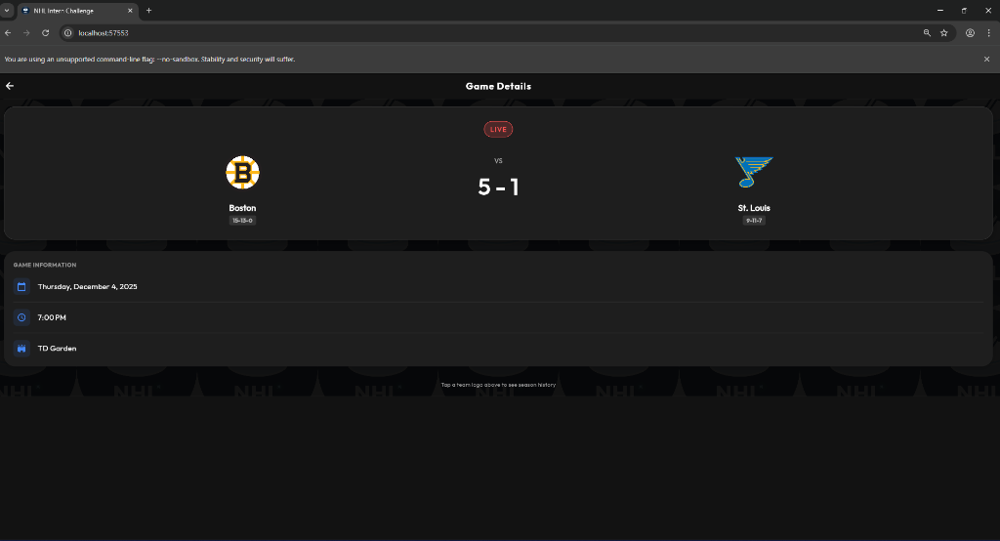
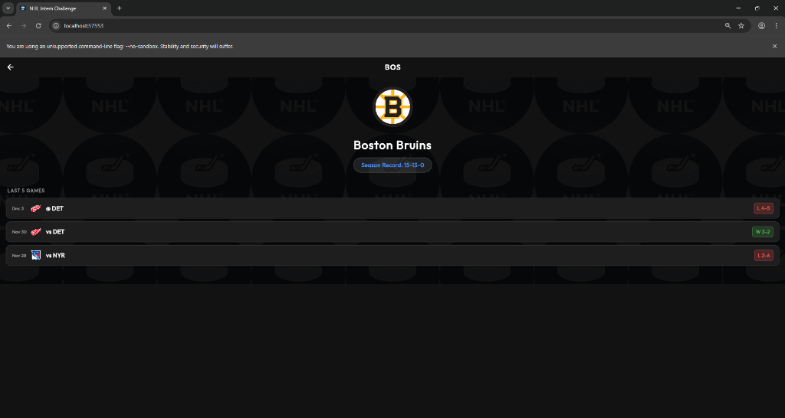
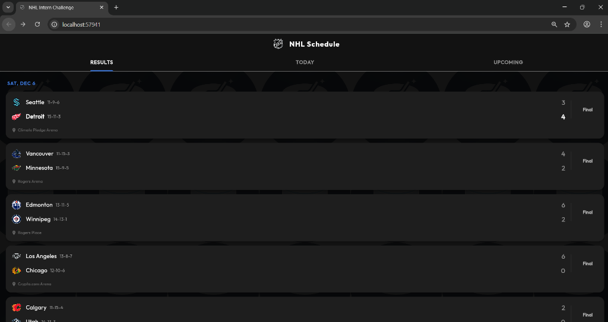
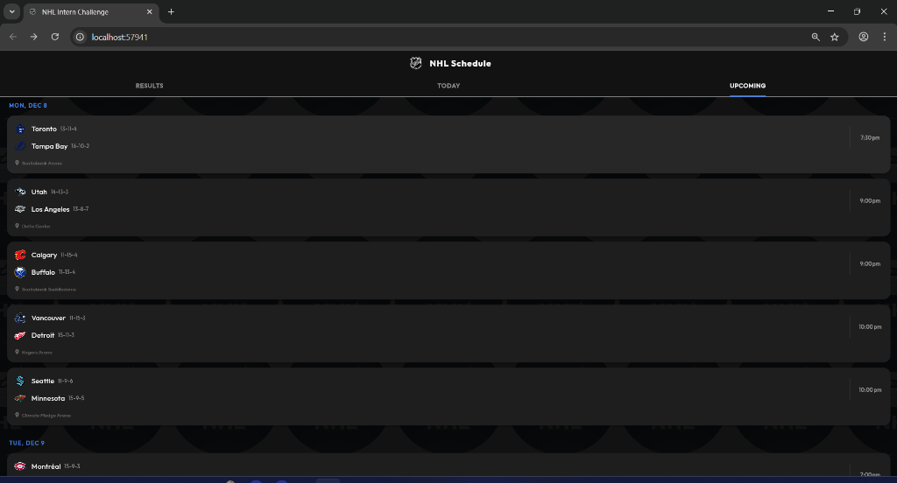

# NHL Scores Live 🏒

A full-stack application that tracks live NHL scores, schedules, and team statistics. Built with a **Node.js** backend for data ingestion and a **Flutter** frontend for a premium mobile/web experience.

## ✨ Features

*   **Live Scoreboard**: Real-time updates with **Live Clock** (e.g., "P3 12:45") and visual status indicators.
*   **Deep Game Data**: Displays **TV Broadcasts** (e.g., TNT, ESPN) and **Winning Goal Scorer** for finished games.
*   **Smart Schedule**: 3-Tab view organizing games into Results, Today, and Upcoming.
*   **Team Details**: Deep dive into team stats, season records, and a calculated "Last 5 Games" history with **Opponent Logos**.
*   **Premium Dark UI**: A sleek, modern interface with consistent branding (Shield Logo) and high-quality team assets.
*   **Cross-Platform**: Runs on iOS, Android, and Web.

## 🏗️ Architecture

The project is divided into two main parts:

### 1. Backend (`/backend`)
*   **Tech Stack**: Node.js, TypeScript, Firebase Admin SDK.
*   **Function**: Fetches data from the official NHL API, enriches it, and syncs it to **Cloud Firestore**.
*   **Key Services**:
    *   `src/ingest.ts`: Orchestrates the polling loop (Smart Polling) and data ingestion.
    *   `src/services/nhlApi.ts`: Handles all NHL API requests.
    *   `src/services/db.ts`: Manages Firestore database connections and batch writes (w/ `ignoreUndefinedProperties`).
    *   `src/utils/helpers.ts`: Utility functions for scheduling and status mapping.
*   **Polling Strategy**:
    *   **Live Game**: Polls every 60 seconds (Partial Fetch: Today's games only, upserts data to preserve history).
    *   **Scheduled**: Sleeps until game time.
    *   **Off-Hours**: Full synchronization every hour (rebuilds history cache).

### 2. Frontend (`/app`)
*   **Tech Stack**: Flutter (Dart), Cloud Firestore, `flutter_svg`.
*   **Function**: Listens to Firestore streams to display real-time data without manual refreshing.
*   **State Management**: StreamBuilder (Reactive UI) for instant updates.
*   **Assets**: Uses local assets for branding (`nhl_logo.svg`) and database-driven Base64 SVGs for teams.

## 🚀 Getting Started

### Prerequisites
*   Node.js & npm
*   Flutter SDK
*   Firebase Project (Firestore enabled)

### Setup

1.  **Clone the repo:**
    ```bash
    git clone https://github.com/harsh74780/NHL-Score-Live.git
    cd NHL-Score-Live
    ```

2.  **Backend Setup (Terminal 1):**
    *   Place your `serviceAccount.json` in `backend/`.
    *   Create a `.env` file in `backend/` (see `.env.example`):
        ```env
        NHL_API_BASE=https://api-web.nhle.com/v1
        GOOGLE_APPLICATION_CREDENTIALS=./serviceAccount.json
        ```
    *   Install dependencies:
        ```bash
        cd backend
        npm install
        ```
    *   Run the ingestion script:
        ```bash
        npx ts-node src/ingest.ts
        ```

3.  **Frontend Setup (Terminal 2):**
    *   Ensure `firebase_options.dart` is configured in `app/lib/`.
    *   Run the app:
        ```bash
        cd app
        flutter run -d chrome  
        ```


## 🧠 Architecture & Reasoning

### The "Team Screen" Challenge
The requirements asked for a Team Screen showing the "Last 5 Games".
*   **The Constraint**: The App is not allowed to call the NHL API directly.
*   **The Problem**: If the ingestion script only fetched "Today's" games, the database would have no history, and the Team Screen would be empty.
*   **The Solution**: I implemented a **Denormalized Data Model**. The backend aggregates game history in memory during ingestion (fetching a 7-day backfill) and writes a summary directly to the `teams` collection. This keeps the client-side logic simple and fast.

### Data Model (Firestore)
*   **`games` Collection**: Stores individual game documents. Includes extended data like `tvBroadcasts`, `winningGoalScorer`, and `periodDescriptor`.
*   **`teams` Collection**: Stores team profiles. Includes `logo` (Base64 SVG) and `last5Games` (including opponent logos).

### Trade-offs & Scope
*   **Logos**: To ensure high-quality rendering and avoid CORS issues on the web, the backend fetches official SVGs, converts them to **Base64 strings**, and stores them directly in Firestore. The Frontend simply decodes them.
*   **Data Persistence**: The "Smart Polling" system was tuned to ensure that "Partial Fetches" (for live speed) do not wipe out the "Last 5 Games" history accumulated by "Full Fetches".

## ⚠️ Assumptions & Limitations

### 1. Data Source
*   **Assumption**: I used the undocumented NHL API (`api-web.nhle.com/v1`) as it provides the most up-to-date JSON structure.
*   **Limitation**: Since this API is unofficial, field names could change.

### 2. Branding
*   **Workaround**: Used a custom widget to fetch high-quality PNGs based on team abbreviations.

## 🤖 AI Usage vs. Human Intelligence

*   **AI**: Used to generate the boilerplate code for Firestore serialization and to lookup API endpoints.
*   **Human Intelligence (HI)**: Used for the architectural decision to split data ingestion into three phases (Standings -> Schedule -> Team Profiles) and for designing the Dynamic Polling Loop to optimize cloud costs.

## 📸 Screenshots

| **Home Screen** | **Game Details** |
|:---:|:---:|
|  |  |

| **Team Details** | **Schedule (Results)** |
|:---:|:---:|
|  |  |

| **Schedule (Upcoming)** |
|:---:|
|  |


## 📄 License

MIT

## 🎥 Presentation

To view the project presentation:
1. Navigate to the `presentation/` folder.
2. Open `presentation.html` in your web browser.

